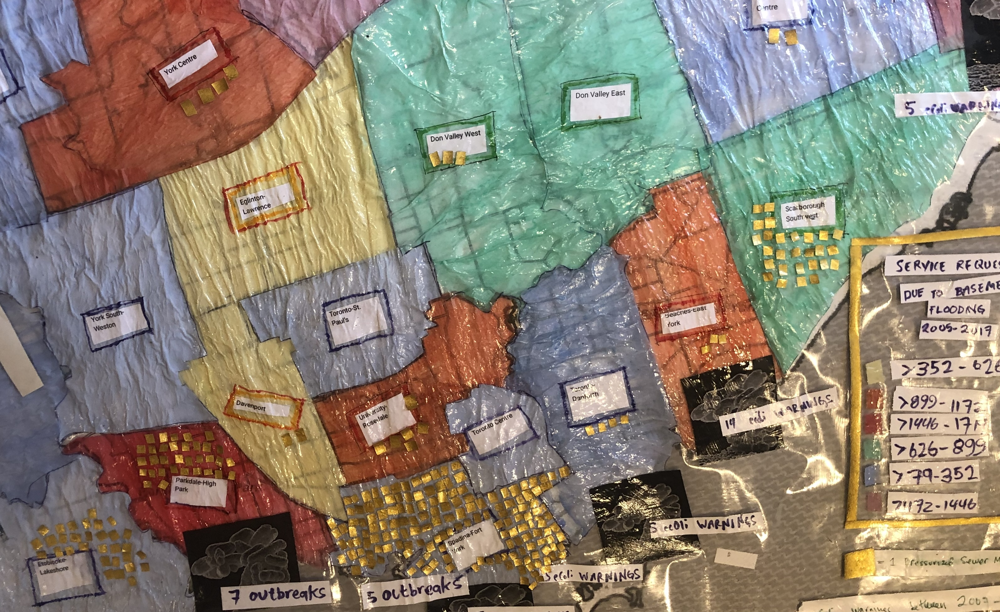

# York Data Science Club, York Library + Toronto Open Data Datathon 2026

Welcome to a repository with some blogathon resources! 

**Visualization Resources**

[Choropleths of basement floodings with Python Folium and Matplotlib (Jupyter Notebook)](https://github.com/sonyaallin/blogathon/blob/main/2026/toronto_flooding_analysis.ipynb)

[Choropleths of Neighborhood Diversity and Crime using GeoPandas, Matplotlib (Jupyter Notebook)](https://github.com/sonyaallin/blogathon/blob/main/2026/diversity.ipynb)

[Trees, Boxplots, Scatterplots and More with Seaboarn and PyPlot (Jupyter Notebook)](https://github.com/sonyaallin/blogathon/blob/main/2026/rentsafe.ipynb)

[Python Graph Gallery](https://python-graph-gallery.com/)

Note that to create a virtual environment and install notebook dependencies you can type:

python3 -m venv blogathon

source blogathon/bin/activate (On a Macl on Windows type: blogathon\Scripts\activate)

pip install -r requirements.txt

jupyter notebook

**If you want to particiapte in Blog Pitches on April 2**

We ask that everyone submit 5 slides by midnight on April 1.

** We will then see you at 10 am April 2 to make your pitch! **

[Submit Slides Here](https://forms.office.com/r/q0pBEfqyCJ)

Some other blog related information that might be of interest:

[An Example Blog Post](https://www.eecs.yorku.ca/~sallin/blog/)

[Another Example Blog Post](https://open.toronto.ca/how-the-city-is-winning-the-war-against-lead-contamination-in-drinking-water/)

[An Example Slide Deck](https://github.com/sonyaallin/blogathon/blob/main/slides/Example-Presentation.pdf)

[Some Blogging Tips](https://github.com/sonyaallin/blogathon/blob/main/slides/Aditya-Presentation.pdf)

[Our York U Blogoathon SLACK](https://join.slack.com/t/yorkuniversit-tha4847/shared_invite/zt-32kpe5g2c-t5ect4jGrxyOVKubBDXWKg)

